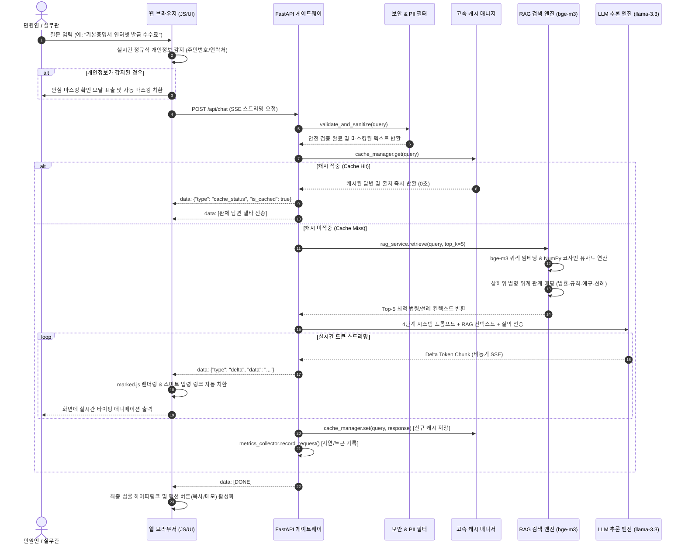

# 🏛️ 대한민국 법원 가족관계등록 실무·심사 AI 지능형 포털
## 대법원 법원행정처 · 감독법원 · 등록관서 종합 업무·기술 설명서 (Court Official Architecture & User Manual)

---

## 📋 목차 (Table of Contents)
1. [서비스 개요 및 개발 목적](#1-서비스-개요-및-개발-목적)
2. [주요 핵심 기능 (Key Features)](#2-주요-핵심-기능-key-features)
3. [시스템 아키텍처 및 기술 스택 (System Architecture & Tech Stack)](#3-시스템-아키텍처-및-기술-스택)
   - 3.1 전체 종합 시스템 아키텍처 구성도
   - 3.2 데이터 흐름 및 실시간 RAG 추론 시퀀스 다이어그램
   - 3.3 계층별(Stack-by-Stack) 상세 기술 명세 및 역할 설명
4. [단일 통합 포털 화면 구성 및 이용 가이드 (Unified All-in-One Interface)](#4-단일-통합-포털-화면-구성-및-이용-가이드)
   - 4.1 다크/라이트 듀얼 테마 (Dark/Light Switcher) 지원
   - 4.2 반응형 3단 올인원(All-in-One) 레이아웃 구조
   - 4.3 대법원·감독법원·관서 공통 AI 질의 및 심사 편의 기능
   - 4.4 등록관서 실무관을 위한 내장 업무 도구 (심사 메모장 & 공공 연계 허브)
   - 4.5 관리자 콘솔 (지식 베이스, 파일 업로드, 보안 및 성능 모니터링)
5. [개인정보 보호 및 보안 필터링 체계](#5-개인정보-보호-및-보안-필터링-체계)
6. [상하위 법령 위계(Hierarchy) RAG 추론 엔진](#6-상하위-법령-위계hierarchy-rag-추론-엔진)
7. [설치, 로컬 실행 및 클라우드 배포 방법](#7-설치-로컬-실행-및-클라우드-배포-방법)
8. [자주 묻는 질문 (FAQ) 및 유지보수 가이드](#8-자주-묻는-질문-faq-및-유지보수-가이드)

---

## 1. 서비스 개요 및 개발 목적

### 1.1 서비스 개요
**「대한민국 법원 가족관계등록 실무·심사 AI 지능형 포털」**은 **대법원 법원행정처, 감독법원(가정법원/지방법원), 전국 시·구·읍·면 등록관서(시청/구청/읍면사무소) 실무관 및 심사관**을 위해 구축된 차세대 사법행정 AI 심사 보조 시스템입니다.

### 1.2 개발 배경 및 목적
- **등록관서 접수·수리 심사 지원**: 복잡한 가족관계등록 사건(출생, 사망, 혼인, 이혼, 개명, 친양자 등)의 수리 요건과 첨부 서면을 즉시 검토.
- **다단계 법령 위계(Hierarchy) 체계적 법리 추론**: 「가족관계의 등록 등에 관한 법률」 ➔ 대법원규칙 ➔ 대법원예규 ➔ 등록선례의 위임 및 우선순위 원칙에 입각하여 불수리·반려 방지 및 감독법원 허가 요건 판단.
- **주간/야간 최적 가독성 (다크/라이트 모드)**: 장시간 공무 환경을 고려하여 고대비 라이트 모드 및 눈이 편안한 다크 모드를 원클릭으로 선택 지원.
- **철저한 개인정보 보호 & 공무 보안**: 당사자의 주민등록번호, 연락처 등 민감 정보가 입력창에 입력되는 즉시 실시간 감지하여 자동 마스킹 처리.

---

## 2. 주요 핵심 기능 (Key Features)

### 📌 ① 심사 답변 4단계 법률 표준 구조화 엔진
모든 실무 답변은 공문서 및 법률 검토서 수준의 신뢰성을 위해 4단계 표준 목차로 자동 서술됩니다:
1. **📌 1. 심사 결론 및 실무 판단 요약**: 수리 가부(수리 가능/불수리 처분/보정 요구), 직권정정 가능 여부(간이직권정정 vs 감독법원 허가 필요)를 2~3줄로 명확하게 우선 제시.
2. **⚖️ 2. 법적 근거 및 규범 체계 (법률-규칙-예규-선례)**: 상위법률 조항(법 제14조, 제18조, 제107조 등), 대법원규칙, 대법원예규, 등록선례를 정확히 인용.
3. **📝 3. 구비 서면 및 심사 검토 항목**: 접수 및 심사 시 확인해야 할 필수 서면, 신청 적격(본인/직계존비속/대리권 소명), 관할 관서 요건을 항목별 불릿으로 정리.
4. **⚠️ 4. 실무 유의사항 및 반려·불수리 방지 지침**: 빈번한 반려 사유, 법정 신고 기한 및 과태료 기준, 불수리통지서 교부 요건, 감독법원(가정법원) 직권정정 허가신청 필요 여부 안내.
5. **💻 [선택적] 전산시스템(e-family/사법행정망) 처리 절차**: 시스템 입력 및 행정망 연계 질의 시에만 단계별 안내 추가.

### 🔗 ② 스마트 법령 자동 하이퍼링크 (Law Linker Engine)
- AI 답변 내에 언급된 **법률 조항(예: 「가족관계의 등록 등에 관한 법률」 제14조)**, **대법원 가족관계등록예규**, **등록선례**를 정규식으로 실시간 감지.
- 클릭 한 번으로 **국가법령정보센터(`law.go.kr`)** 또는 **대한민국 법원 전자관보/종합법률정보(`glaw.scourt.go.kr`)**로 연결되어 즉시 법조문 원문을 열람할 수 있습니다.

### 🛡️ ③ 입력부터 원천 차단하는 개인정보 안심 필터 (Privacy Guard)
- **실시간 타이핑 가드**: 입력창에 주민등록번호(13자리), 휴대전화번호, 이메일 등이 입력되면 실시간 안내 바가 표시됩니다.
- **원클릭 안심 마스킹**: 사용자가 원클릭으로 마스킹(`YYMMDD-G******`, `010-****-5678`)하여 전송하거나, 확인 모달을 통해 안전하게 개인정보가 치환된 상태로만 LLM에 전달됩니다.
- **유해/비속어 방어**: 공공 서비스에 부적절한 욕설, 비방, 프롬프트 인젝션 시도를 서버 단에서 안전하게 사전 차단합니다.

### 📊 ④ 상하위 법령 위계(Hierarchy) RAG 지식 체인
- **1단계 법률 ➔ 2단계 대법원규칙 ➔ 3단계 대법원예규 ➔ 4단계 등록선례**의 법적 위계 관계와 위임 원칙을 엑셀(.xlsx)로 자동 파싱.
- 단순 단어 검색이 아닌, **상위 법률과 하위 예규·선례의 적용 순위**를 인공지능이 스스로 파악하여 답변에 반영합니다.

### ⚡ ⑤ 고성능 지능형 캐시 & 비용 모니터링
- 반복되는 법령 및 증명서 발급 문의는 **0초 만에 인메모리 고속 캐시로 즉시 응답**.
- 캐시 적중률, 절약된 토큰 수, 평균 지연시간(Latency)을 관리자 콘솔에서 실시간 그래프 및 지표로 확인 가능.

---

## 3. 시스템 아키텍처 및 기술 스택

### 3.1 전체 종합 시스템 아키텍처 구성도 (Full-Stack Architecture)

```mermaid
graph TB
    subgraph ClientTier ["1. 클라이언트 프레젠테이션 계층 (Frontend Client Tier)"]
        UI["반응형 웹 UI (HTML5 / Vanilla CSS)"]
        TypingGuard["실시간 PII 타이핑 인터셉터"]
        LawLinker["스마트 법령 하이퍼링크 파서"]
        SSEReader["SSE 스트리밍 이벤트 수신기"]
        AdminUI["관리자 지식 & 메트릭 콘솔"]
    end

    subgraph SecurityGatewayTier ["2. 보안 및 API 게이트웨이 계층 (API Gateway & Security Layer)"]
        FastAPI["FastAPI 비동기 웹 프레임워크 (ASGI)"]
        CORS["CORS & 정적 파일 핸들러"]
        InputFilter["개인정보 마스킹 & 유해어 차단 엔진"]
        AuditLogger["보안 감사 & 마스킹 통계 집계기"]
    end

    subgraph OptimizationTier ["3. 성능 최적화 및 캐시 계층 (Optimization & Cache Tier)"]
        CacheManager["인메모리 질의응답 캐시 (0초 즉시 응답)"]
        MetricsCollector["토큰 절약량 & Latency 모니터링 엔진"]
    end

    subgraph RAGTier ["4. 지식 검색 및 RAG 추론 계층 (RAG & Knowledge Retrieval Tier)"]
        RAGService["RAG 파이프라인 코디네이터"]
        BGEEmbedding["BAAI/bge-m3 고밀도 벡터 임베더"]
        CosineEngine["NumPy 코사인 유사도 검색 엔진"]
        HierarchyParser["상하위 법령 위계 체인 파서 (Excel)"]
        DocChunker["실무편람 PDF / JSON 동적 청커"]
    end

    subgraph LLMTier ["5. 대형 언어 모델 및 추론 엔진 계층 (LLM & Reasoning Engine)"]
        LLMClient["비동기 HTTPX 스트리밍 클라이언트"]
        PromptEngine["4단계 법률 표준 시스템 프롬프트 엔진"]
        LlamaModel["llama-3.3-70b (표준·고속 추론)"]
        GptModel["gpt-oss-120b (심층 복합 추론)"]
    end

    subgraph StorageTier ["6. 지식 베이스 및 스토리지 계층 (Knowledge & Storage Layer)"]
        CorpusJSON["가족관계등록 코퍼스 (corpus_metadata.json)"]
        VectorNPY["bge-m3 벡터 인덱스 (corpus_embeddings.npy)"]
        UploadsStore["업로드 원본 보관소 (/data/uploads)"]
        HierarchyRules["위임·적용 법리 규칙 베이스"]
    end

    %% 연결 관계 (Flows)
    UI --> TypingGuard --> SSEReader
    SSEReader -->|HTTPS / SSE Request| FastAPI
    FastAPI --> InputFilter --> AuditLogger
    InputFilter --> CacheManager
    
    CacheManager -->|Cache Miss| RAGService
    CacheManager -->|Cache Hit (0s)| SSEReader
    
    RAGService --> BGEEmbedding
    BGEEmbedding --> CosineEngine
    CosineEngine <--> VectorNPY
    CosineEngine <--> CorpusJSON
    
    HierarchyParser <--> UploadsStore
    HierarchyParser --> HierarchyRules --> RAGService
    DocChunker --> CorpusJSON
    
    RAGService -->|Top-K 법령 컨텍스트 주입| PromptEngine
    PromptEngine --> LLMClient
    LLMClient --> LlamaModel
    LLMClient --> GptModel
    LLMClient -->|SSE Chunk Token Stream| FastAPI
    FastAPI --> LawLinker --> UI
    
    MetricsCollector <--> FastAPI
    AdminUI <--> FastAPI
```

---

### 3.2 데이터 흐름 및 실시간 RAG 추론 시퀀스 다이어그램 (Sequence Diagram)



---

### 3.3 계층별(Stack-by-Stack) 상세 기술 명세 및 역할 설명

#### 1) 프론트엔드 프레젠테이션 계층 (Frontend Presentation Layer)
- **Vanilla JavaScript (ES6+)**: 외부 무거운 프레임워크 의존 없이 번들 사이즈를 극소화(약 70KB)하여 모바일 및 PC 브라우저에서 0.1초 즉시 초기 로딩 달성.
- **Glassmorphism CSS Design System**: 다크 네이비 테마 기반의 고급스러운 반투명 글래스 UI와 반응형 3단 레이아웃(좌측 민원 바로가기 / 중앙 실시간 채팅 / 우측 실무 메모장).
- **Server-Sent Events (SSE) Engine**: `fetch` API와 `ReadableStreamDefaultReader`를 결합하여 백엔드 토큰 청크를 지연 없이 실시간 수신.
- **Dynamic Law Linker**: 마크다운 파싱 후 정규식(`linkifyLawReferences`)을 통해 `가족관계의 등록 등에 관한 법률 제14조`, `가족관계등록예규 제500호` 등을 **국가법령정보센터(`law.go.kr`)** 및 **대법원 종합법률정보(`glaw.scourt.go.kr`)** 링크로 실시간 앵커링.

#### 2) 백엔드 및 API 게이트웨이 계층 (API Gateway & Backend Application Layer)
- **FastAPI (ASGI Framework)**: 고성능 비동기 Python 웹 프레임워크로 엔드포인트 라우팅 및 실시간 SSE 스트리밍 제공.
- **Uvicorn Server**: 초경량 고성능 비동기 웹 서버 (동적 `HOST`, `PORT` 환경변수 지원).
- **Pydantic v2**: 엄격한 데이터 타입 검증 및 요청/응답 직렬화.
- **Async HTTPX Client**: 커넥션 풀링(Connection Pooling)과 60초 타임아웃 및 동시성 429 감지 시 **지수 백오프 자동 재시도(Exponential Backoff Retry)** 지원.

#### 3) 지능형 보안 및 개인정보 보호 계층 (Security & Privacy Filtering Layer)
- **Dual-Phase Masking Filter**:
  - 클라이언트 단계: 타이핑 중 정규표현식(`Regex`) 실시간 탐지.
  - 서버 게이트웨이 단계: `input_filter.py`에서 주민번호 13자리, 휴대폰 번호, 이메일을 식별하여 즉시 `YYMMDD-G******`, `010-****-5678`로 마스킹 치환.
- **유해어 및 프롬프트 인젝션 방어**: 공공 상담에 부적절한 비속어, 공격성 프롬프트를 차단하고 안전한 표준 답변으로 유도.

#### 4) 지식 검색 및 RAG 추론 계층 (RAG & Knowledge Retrieval Tier)
- **BAAI/bge-m3 다국어 고밀도 임베딩**: 한국어 법률 용어와 문맥을 가장 정확하게 포착하는 1024차원 고밀도 벡터 생성.
- **NumPy Cosine Matrix**: 고가의 벡터 DB 없이도 메모리 상에서 수천 건의 법률 문서를 0.005초 만에 밀리초 단위로 초고속 유사도 연산.
- **Excel Hierarchy Chain Parser (`excel_hierarchy_parser.py`)**: `상위법률 ➔ 대법원규칙 ➔ 대법원예규 ➔ 등록선례 ➔ 위임원칙` 6개 컬럼을 계층형 지식 그래프 트리 구조로 자동 파싱.
- **Dynamic Document Chunking (`document_parser.py`)**: PDF 실무편람 및 JSON 지식을 700자 단위(Overlap 150자)로 분할하여 핵심 문맥 보존.

#### 5) 성능 최적화 및 동시성 대기열 계층 (Performance Optimization & Concurrency Queue Layer)
- **전역 비동기 세마포어 대기열 (`llm_client.py: llm_semaphore`)**: 상위 LLM의 동시 요청 1건(Concurrency: 1) 및 10 RPM 한도를 준수하기 위해, 동시 요청 발생 시 429 오류를 내지 않고 대기열(Queue)에 안전하게 진입시켜 1~3초 간격으로 순차 자동 처리.
- **실시간 대기 UX 인디케이터 (`app.js: queue_status`)**: 앞선 요청이 진행 중일 때 대기 중인 사용자에게 `⏳ 앞선 민원 상담 처리 중 (대기 순번: N번, 예상: 약 M초)` 알림 바를 실시간 표출하여 자연스러운 사용자 경험(UX) 보장.
- **In-Memory Query Cache (`cache_manager.py`)**: 정규화된 질문 키를 기반으로 동일/유사 질의 시 LLM 호출 없이 **0초 즉시 응답** (동시성 0 소모, 토큰 비용 100% 절감).
- **Metrics Collector (`metrics_collector.py`)**: 실시간 누적 질의 수, 캐시 적중률(Hit-rate %), 절약된 토큰 수, 평균 지연시간(Latency)을 집계하여 관리자 화면에 제공.
- **Live Force Regeneration**: 캐시된 응답이라도 사용자가 `[🔄 실시간 재추론]`을 누르면 캐시를 즉시 우회(Bypass)하여 실시간 신규 추론 수행.

#### 6) 대형 언어 모델 및 프롬프트 엔진 계층 (LLM & Prompt Engine)
- **llama-3.3-70b (기본 채택)**: 최신 고성능 오픈 가중치 모델로 복잡한 한국어 법률 질의에 대해 뛰어난 추론과 빠른 스트리밍 속도 보장.
- **gpt-oss-120b (선택 가능)**: 다단계 상하위 법령 위계 및 복잡한 선례 분석 시 심층 추론 제공.
- **4단계 법률 표준 프롬프트 엔진 (`system_prompt.py`)**:
  - `📌 1. 핵심 요약 및 결론 ➔ ⚖️ 2. 법적 근거 ➔ 📝 3. 구비 서류 ➔ ⚠️ 4. 실무 유의사항`
  - 발급/신고 절차 질의 시에만 efamily 온라인 안내를 조건부 부착하여 답변의 군더더기 제거.

---

## 4. 단일 통합 포털 화면 구성 및 이용 가이드 (Unified All-in-One Interface)

본 시스템은 민원인 모드와 실무관 모드를 별도로 분리하여 전환하는 번거로움 없이, **모든 사용자가 하나의 화면에서 필요한 기능을 직관적으로 활용할 수 있는 「단일 통합 올인원(All-in-One) 포털 인터페이스」**로 구성되어 있습니다.

```
┌────────────────────────────────────────────────────────────────────────────────────────┐
│ [상단 헤더] 🏛️ 법원 전자가족관계등록 AI 포털  |  [Llama-3.3-70B ▼] [RAG 토글]  [⚙️ 관리자 콘솔] │
├───────────────────┬────────────────────────────────────────────┬───────────────────────┤
│ 📁 좌측 사이드바     │ 💬 중앙 메인 AI 상담창                     │ 📝 우측 실무 도구함    │
│                   │                                            │                       │
│ • 10대 전자민원     │ • 추천 빠른 질의 프리셋 (#출생신고, #개명 등)   │ • 실무 공무 메모장    │
│   바로가기 포털    │ • 실시간 4단계 법률 AI 상담 스트리밍         │   (상담내용 로컬저장) │
│ • 4대 핵심 법령    │ • 스마트 법조문 원클릭 하이퍼링크           │ • 5대 공공 포털 링크  │
│   조문 바로가기    │ • 답변 액션바 (복사 / 실시간 재추론 / 메모담기)│   (대법원/종합법률/   │
│                   │ • 실시간 개인정보(주민번호/연락처) 타이핑 가드 │    정부24/전자소송)   │
└───────────────────┴────────────────────────────────────────────┴───────────────────────┘
```

---

### 4.1 반응형 3단 올인원(All-in-One) 레이아웃 구조
- **좌측 패널 (전자민원 & 법령 바로가기 포털)**:
  - 10대 대표 전자가족관계등록 서비스(가족관계증명서, 기본증명서, 혼인관계증명서, 출생신고, 개명신고 등)의 대법원 공식 신청 페이지 링크를 상시 제공.
  - 가족관계등록법, 대법원규칙, 가족관계등록예규, 등록선례 4대 핵심 법령 원문 바로가기 탭 제공.
- **중앙 메인 패널 (실시간 AI 법률 상담 & 대화창)**:
  - 자연어 질문 입력창 및 실시간 4단계 구조화 법률 답변 스트리밍 뷰포트.
  - 실시간 PII(주민등록번호/연락처) 타이핑 감지 및 자동 마스킹 알림 바.
- **우측 패널 (실무 메모장 & 공공 연계 허브)**:
  - 민원 상담 내용, 접수 번호, 심사 특이사항을 실시간 기록하는 **내장형 공무 메모장**.
  - 대법원 전자가족관계등록시스템, 대한민국 법원 전자관보, 종합법률정보, 정부24, 대법원 전자소송 등 **5대 유관 공공 포털 다이렉트 링크 허브**.

---

### 4.2 대국민 & 실무 공통 AI 질의 및 답변 편의 기능
1. **자연어 대화 질의**:
   - 일상 언어로 질문을 입력 (예: *"가족관계증명서 인터넷 발급 방법과 수수료 알려줘"*, *"출생신고 기한과 필요 서류는?"*).
   - 인공지능이 즉시 4단계 표준 목차(`📌 1. 핵심 요약 ➔ ⚖️ 2. 법적 근거 ➔ 📝 3. 구비 서류 ➔ ⚠️ 4. 실무 유의사항`)로 정돈된 법률 상담을 실시간 스트리밍합니다.
2. **원클릭 스마트 법령 하이퍼링크**:
   - 답변 내에 인용된 법조문(예: `가족관계의 등록 등에 관한 법률 제14조`, `가족관계등록예규 제500호`)을 클릭하면 **국가법령정보센터(`law.go.kr`)** 또는 **대법원 종합법률정보(`glaw.scourt.go.kr`)** 해당 조문으로 새 창 연결.
3. **답변 편의 액션 도구바 (Answer Action Bar)**:
   - 📋 **답변 복사**: 마크다운 특수문자를 깔끔하게 제거한 텍스트로 클립보드에 복사 (민원 안내문 또는 공문서 인용 시 유용).
   - 🔄 **실시간 재추론 (새 답변)**: 캐시를 우회하여 최신 AI로 새로운 관점의 심층 답변 실시간 재생성.
   - 🌐 **전자가족관계등록시스템 바로가기**: 대법원 efamily 공식 전자신고/발급 페이지로 원클릭 이동.
   - 📝 **공무 메모장에 담기**: 클릭 한 번으로 AI 답변 요약본을 우측 실무 메모장에 자동 삽입.
4. **상단 빠른 추천 사례 바 (Quick Cases)**:
   - *#가족관계증명서 발급*, *#출생신고 구비서류*, *#개명신고 절차*, *#혼인신고 효력발생*, *#사망신고 기한 및 서류* 등 빈번한 대표 민원 원클릭 질의 지원.

---

### 4.3 등록관서 실무관을 위한 내장 업무 도구 (Official Tools)
- **내장형 실무 공무 메모장 (Official Memo)**:
  - 복잡한 민원 상담 중 접수번호, 당사자 인적사항 확인 사항, 심사 보정 요구사항 등을 실시간 메모.
  - 브라우저 로컬스토리지에 자동 보존되어 새로고침 후에도 내용이 안전하게 유지됩니다.
- **5대 유관 공공 포털 연계 허브**:
  - 타 사이트를 검색할 필요 없이 우측 패널에서 대법원 전자관보, 종합법률정보, 정부24 전자지갑, 전자소송 사이트로 즉시 이동.

---

### 4.4 독립 전용 관리자 콘솔 (`/admin`) 및 암호화 보안 인증
일반 사용자 화면의 상단 헤더 버튼에서 완전히 분리되어 **독립된 전용 관리자 URL (`/admin`)**로 운영되며, **솔트 결합 SHA-256 암호화 인증 체계**로 안전하게 보호됩니다:
- **접속 URL**: `http://127.0.0.1:8000/admin` (또는 `https://[서버주소]/admin`)
- **보안 인증 체계**: 관리자 인증코드 입력 시 백엔드에서 솔트(Salt)와 결합된 SHA-256 단방향 해시로 검증 후, 안전한 암호학적 세션 토큰(`Bearer Token`)을 발급합니다.
- **주요 관리 기능**:
  1. **Tab 1. 파일 업로드**: PDF 실무편람, 정형 JSON 지식, 상하위 법령 위계 엑셀(.xlsx)을 드래그 앤 드롭으로 업로드 및 실시간 bge-m3 임베딩 색인.
  2. **Tab 2. 수동 지식 등록**: 새로 제정된 대법원예규나 개별 선례를 직접 입력하여 즉시 RAG 지식 베이스에 추가.
  3. **Tab 3. 지식 & 청크 관리**: 등록된 문서 목록을 '파일별 묶음 보기' 또는 '개별 청크 보기'로 검색 및 관리, 전체 재색인, 초기 기본 코퍼스 복원.
  4. **Tab 4. 비용 & 지연 모니터링**: 캐시 적중률, 절약된 토큰 수, 평균 지연시간, 실시간 캐시 초기화 기능.
  5. **Tab 5. 개인정보 & 보안 필터링**: 누적 개인정보 마스킹 건수(주민번호/전화번호), 부적절한 입력 차단 실시간 통계 모니터링.
  6. **Tab 6. 실무 질의 이력 감사 (Query Audit Logs)**: 실무관 및 민원인의 실제 질의와 AI 4단계 심사 답변, 인용된 법령 출처, 소요시간/토큰, PII 감지 여부를 실시간 기록 및 감사(검색, 페이지네이션, 팝업 상세 조회, JSON 전체 다운로드).

---

## 5. 개인정보 보호 및 보안 필터링 체계

| 단계 | 처리 내용 | 적용 기술 |
| :--- | :--- | :--- |
| **1단계: 실시간 타이핑 감지** | 입력창에 13자리 주민번호나 휴대폰 번호 입력 시 즉시 감지하여 경고 바 노출 | 정규표현식(Regex) 기반 실시간 이벤트 리스너 |
| **2단계: 전송 전 확인 모달** | 민감 정보가 포함된 경우 전송을 일시 차단하고, 자동 마스킹 미리보기를 제공하여 확인 유도 | 클라이언트 모달 인터셉터 |
| **3단계: 백엔드 보안 정제** | LLM API 전송 직전 주민등록번호(`YYMMDD-G******`), 전화번호(`010-****-5678`), 이메일 자동 치환 | `backend/security/input_filter.py` |
| **4단계: 유해 입력 사전 차단** | 욕설, 비방, 인젝션 공격 시도 감지 시 정중한 안내 메시지와 함께 질의 실행 차단 | 유해 키워드 및 보안 정책 필터링 |

---

## 6. 상하위 법령 위계(Hierarchy) RAG 추론 엔진

본 시스템은 공공 법률 업무의 특수성을 고려하여 **법률 간의 상하위 위계 구조**를 완벽하게 인식합니다:

```
[1단계] 법률 (가족관계의 등록 등에 관한 법률 / 민법)
   └── [2단계] 대법원규칙 (가족관계의 등록 등에 관한 규칙)
         └── [3단계] 대법원예규 (가족관계등록예규)
               └── [4단계] 등록선례 (가족관계등록선례)
```

- **위계 원칙**: 상위법 우선의 원칙, 특별법 우선의 원칙을 AI가 스스로 인지하여 하위 예규나 선례가 상위 법률에 저촉되지 않는 올바른 실무 판단을 도출합니다.
- **엑셀 등록 지원**: 관리자가 `업무구분, 상위법률(1단계), 대법원규칙(2단계), 대법원예규(3단계), 등록선례(4단계), 위임/적용원칙` 엑셀 양식을 업로드하면 자동으로 다단계 계층 체인이 구축됩니다.

---

## 7. 설치, 로컬 실행 및 클라우드 배포 방법

### 7.1 로컬 개발 환경 실행
```bash
# 1. 의존성 패키지 설치
pip install -r requirements.txt

# 2. 서버 실행
python run_server.py
```
> 브라우저에서 **`http://127.0.0.1:8000`** 접속

### 7.2 클라우드 24시간 무료 배포 (Render.com)
1. GitHub 저장소에 프로젝트 업로드
2. **Render.com** ➔ **New Web Service** 생성 ➔ 저장소 연결
3. 환경 변수 등록:
   - `PYTHONIOENCODING`: `utf-8`
   - `OPENAI_BASE_URL`: `https://open.hasa.re.kr/v1`
   - `OPENAI_API_KEY`: `sk-dev-Un5B6gafFJxVcRwGnw5AlT23wDGn1ooA`
4. **Create Web Service** 클릭 ➔ 1분 후 공용 `https://xxxx.onrender.com` 주소 발급 완료!

### 7.3 Docker 컨테이너 배포
```bash
docker compose up -d --build
```

---

## 8. 자주 묻는 질문 (FAQ) 및 유지보수 가이드

**Q1. 법조문 링크를 클릭했을 때 원하는 조문이 안 열리면 어떻게 하나요?**
> A. 국가법령정보센터(`law.go.kr`)의 표준 법령 검색 API 규격에 맞춰 자동 연동되어 있으며, 법령명과 조문 번호(예: 제14조)가 있으면 해당 조문 위치로 자동 스크롤됩니다.

**Q2. 새로운 가족관계등록 예규나 선례가 제정되면 어떻게 반영하나요?**
> A. 상단 `[⚙️ 관리자 콘솔]` ➔ `[파일 업로드]`에서 PDF 또는 엑셀 파일을 업로드하거나, `[수동 지식 등록]`에서 새 조문을 입력하면 즉시 bge-m3 벡터 임베딩이 생성되어 상담에 바로 반영됩니다. (서버 재시작 불필요)

**Q3. 캐시된 답변 대신 최신 AI 추론 답변을 강제로 받고 싶을 때는?**
> A. 답변 하단의 **`[🔄 실시간 재추론 (새 답변)]`** 버튼을 누르면 캐시를 우회하여 즉시 최신 LLM이 실시간 재추론을 진행합니다.

---

**© 2026 대한민국 법원 전자가족관계등록시스템 AI 민원 상담 & 실무 포털 | All Rights Reserved.**
